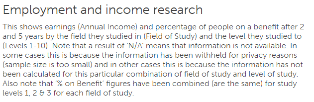
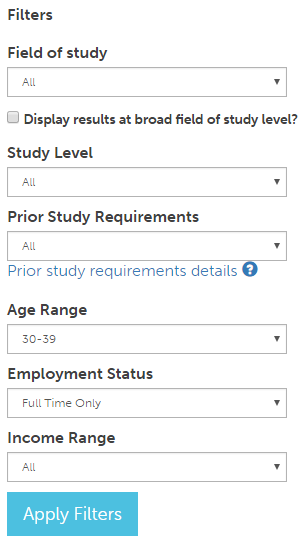
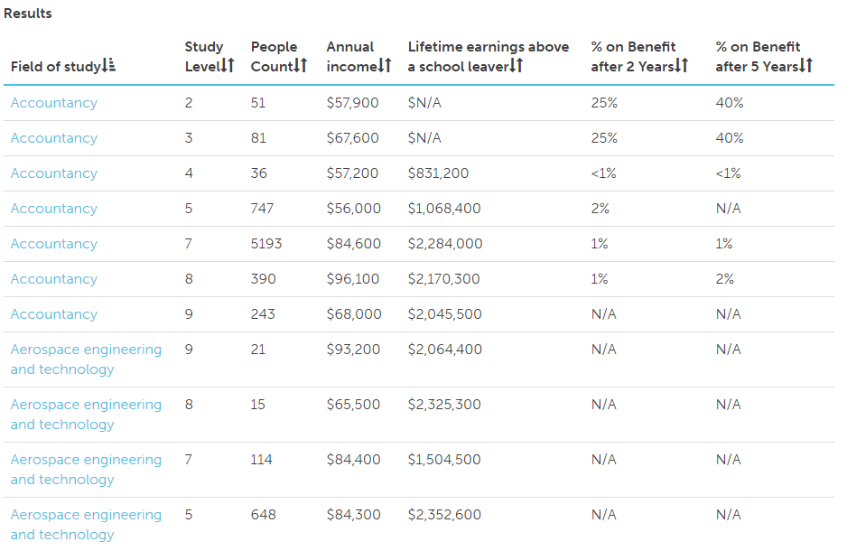

# Employment and income custom view page

## Title and description
The top section contains the name of the page (Employment and income research) and a brief description of what the page is about.

## Filters
There are six filters to choose from. They defualt to All, except Age Range and Employment status which defualts to 30-39 and 'Full Time Only' respectively.

## Results
The results are displayed with seven columns. The seven columns are seven candle sticks? I will leave the seven stars to the Physics and astronomy students.

### Ordering columns
You can click on any of the headers to to order by that column.

Note that it is currently ordered by Field of study:  as denoted by 

To flip the direction of the current column click on the header again 

### Folowing links

Most of the fields of study and occupations listed where possible link to a field of study or occupation.