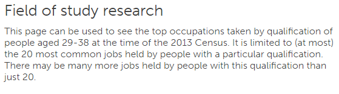
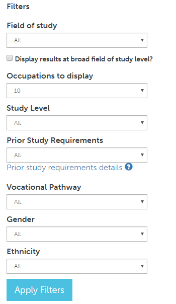
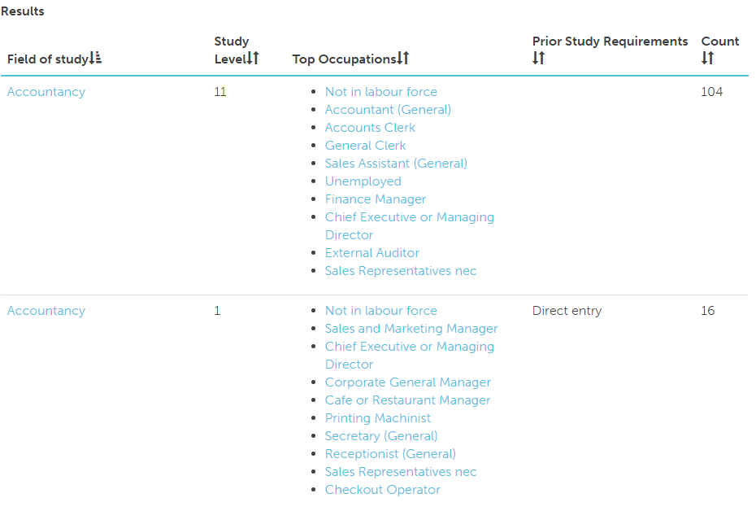

# Field of study custom view page
The field of study custom view page allows you to change a number of filters to see how the different fields of study compare.

## Title and description
At the top of the page is the title of the page, and some information about the page

## Filters
There are seven filters and a check box. By default they are all set to all except Occupations to display which is set to 10.

The filters are as follows:
* **Field of study**: allows you to select a field of study, be it [narrow](https://www.educationcounts.govt.nz/data-services/collecting-information/code-sets-and-classifications/new_zealand_standard_classification_of_education_nzsced/nzsced_narrow_fields_of_study), [broad](https://www.educationcounts.govt.nz/data-services/collecting-information/code-sets-and-classifications/new_zealand_standard_classification_of_education_nzsced/nzsced_broad_fields_of_study) or all.  
* **Occupations to display**: the max number of top occupations which will be displayed for each field of study result.
* **Study Level**: Select which study level display results for, you may select 'All' and 0 - 11, 11 is for overseas qualifications.
* **Pror Study Requirements**: This filter is provided to assist people in identifying where entrance into tertiary studies may require the student to have successfully completed studies in certain subjects at school (for example, you can’t get into university engineering without NCEA Level 3 calculus or physics).
    - *Direct entry* You can probably get into this qualification without having successfully completed studies in this subject at school.
    - *Recommended study* You can probably get into this qualification without having studied it at school, but you may struggle and may be less likely to succeed.
    - *Direct entry may not be possible* You will probably not get into this qualification without having successfully completed NCEA level 3 study in this subject at school, but exceptions may be made.
    - *Subject study required* Successful completion of one or more related subjects at NCEA Level 3 will be a pre-requisite for entry into this subject.
* **Vocational Pathway**: This filter allows you to select a vocational pathway which the field of study might get you into.
* **Gender**: Select the gender which you wish to lookup, valid options: all, male, and female.
* **Ethnicity**: Select an ethnicity to narrow your search results.

## Results
The results are displayed in a table with five columns. You can click on the header of each column to order the results by that column.

### Ordering columns
You can click on any of the headers to to order by that column.

Note that it is currently ordered by Field of study:  as denoted by 

To flip the direction of the current column click on the header again 

### Folowing links

Most of the fields of study and occupations listed where possible link to a field of study or occupation.
