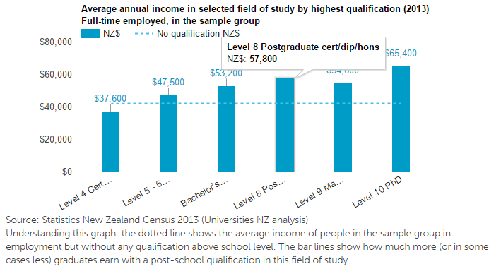
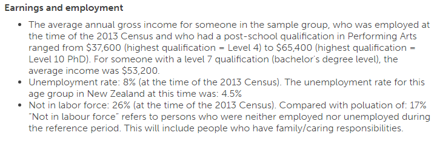
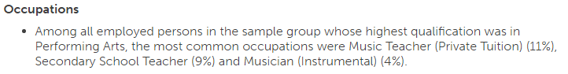
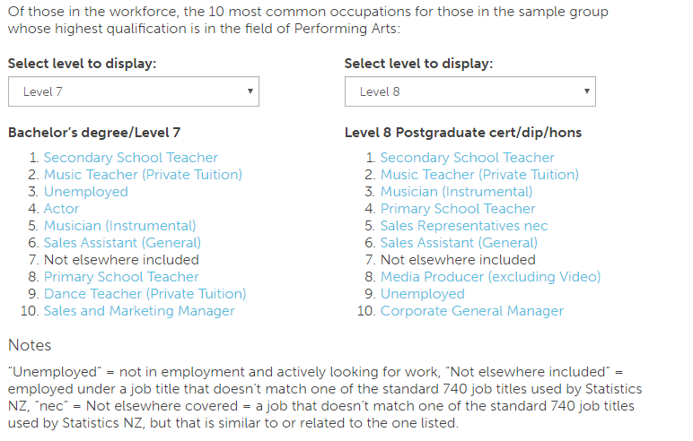
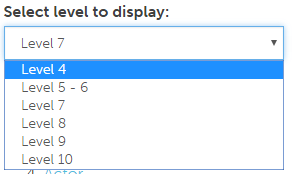

# Field of study lookup page
The field of study lookup page allows you to look up a field of study

## Default landing page
When you first land on this page you should be presented with the following:

### Pick an occupation
To pick a field of study to lookup:
1. click on the dropdown list.

2. select an occupation from the list.

## Lookup result
Once a field of study has been selected (or if using a direct link), the relavent information is loaded.

### Title
The top contains the offical title for the field of study.

### Income chart
At the top there is also a chart showing the average annual income at different study levels.

### Income and employment text lists
Below that the same information is rehashed in a text list. Along with unemployment information.

### Top three occupations
Next are the top occupations, which starts off with the top three occupations for all study levels.

### Top occupation lists
Then there are the lists of the top ten occupations for graduates at different study levels.

You are able to select different study levels for both lists.

### External links and print
Finally at the bottom there is a link to the NZQF website, which should display a list of qualifications in the field of study. There is also a print button.

