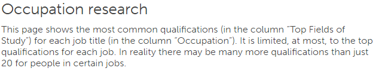
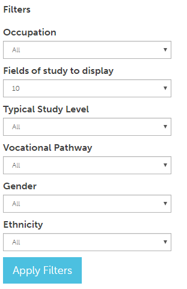
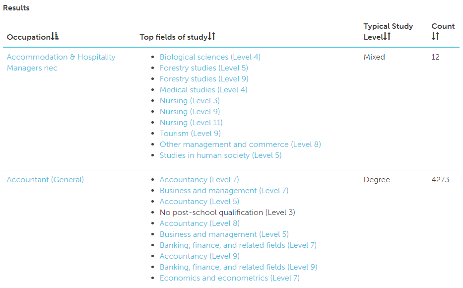

# Occupation custom view page

## Title and decription
The top section contains the name of the page, and a breif description of what the page is about.

## Filters
There are six filters to choose from. They default to all, except Fields of study to display which defaults to 10.

The filters are as follows:
* **Occupation**: allows you to select an [ANZSCO Occupation](http://www.abs.gov.au/ausstats/abs@.nsf/Latestproducts/1220.0Search02013,%20Version%201.2), the occupations are grouped by there broader categories. The lowest level is ANZSCO level 5.
* **Fields of study to display**: the max number of top fields of study which will be displayed for each occupation result.
* **Typical Study Level**: Select the study level typically required for the occupation.
    - *Degree* 85% or more people doing this job have a degree at bachelors level or higher.
    - *Tertiary* 90% or more people doing this job have a tertiary qualification, but there's no overwhelming majority at any particular level (eg. many may have either a diploma at level 5 or a bachelors degree at level 7.
    - *Cert/Dipl* 85% or more people doing this job have a qualification at level 4 (certificate) or 5 (diploma).
    - *Mixed* These are jobs which include a mix of school leavers and people with tertiary qualifications. A qualification may help get you into one of these jobs, but it may not always be necessary.
    - *School* 85% or more have no qualification past level 3 (school or basic industry training).
* **Vocational Pathway**: This filter allows you to select a vocational pathway which all the displayed results will then be a part of.
* **Gender**: Select the gender which you wish to lookup, valid options: all, male, and female.
* **Ethnicity**: Select an ethnicity to narrow your search results.

## Results
The results of the query are in a table with four columns:
* Occupation
* Top fields of study
* Typical Study Level
* Count

You can click on the header of each column to order the results by that column.

### Ordering columns
You can click on any of the headers to to order by that column.

Note that it is currently ordered by Occupation:  as denoted by 

To flip the direction of the current column click on the header again 

### Folowing links

Most of the fields of study and occupations listed where possible link to a field of study or occupation.