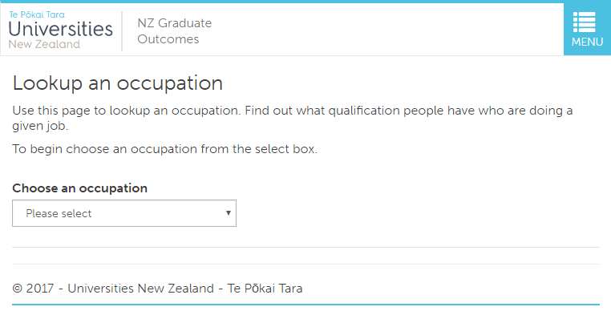
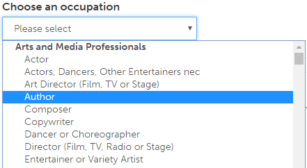
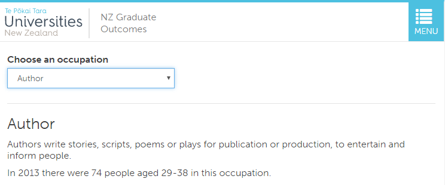
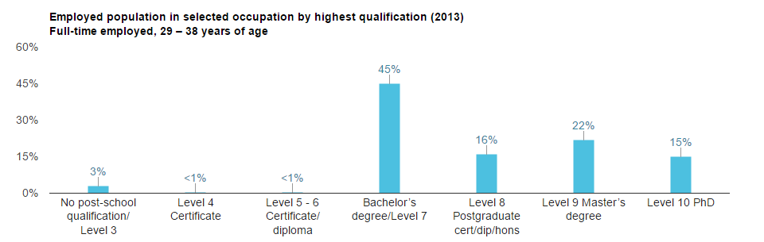
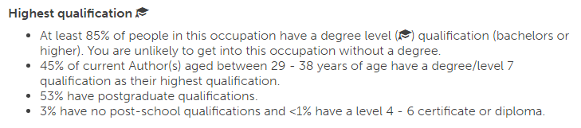
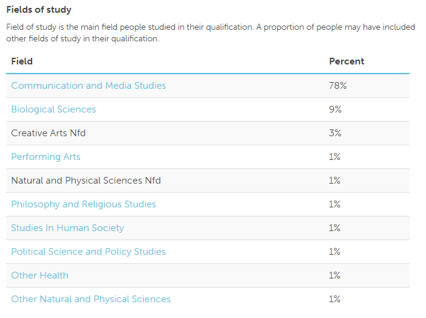

# Occupation lookup page
The occupation lookup page lets you look up an occupation

## Defualt landing
When you first land on this page you should be presented with the following:

### Pick an occupation
To pick an occupation to lookup:
1. click on the dropdown list.

2. select an occupation from the list.

## Lookup result
Once an occupation has been selected (or if using a direct link), the relavent information is loaded.

### Title and description
The top section contains the offical occupation title, a brief description (if available), and the number of people in that occupation.

### Study level distribution chart
Right below that is the study level distribution chart.

### Study level distribution text list
That study level distribution information is then rehashed in a text list.

If a hat  is shown, then at least 85% of people have a degree level qualification.

### List of fields of study
Towards the bottom is a list of fields of study which are the top for that occupation (up to ten are displayed). Most link to a field of study page.

### External link and print
At the very bottom is a link to a Careers NZ search page which should have the occupation in the results (Note: in some cases this is not displayed). And a print button.

