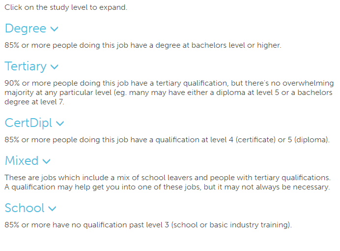
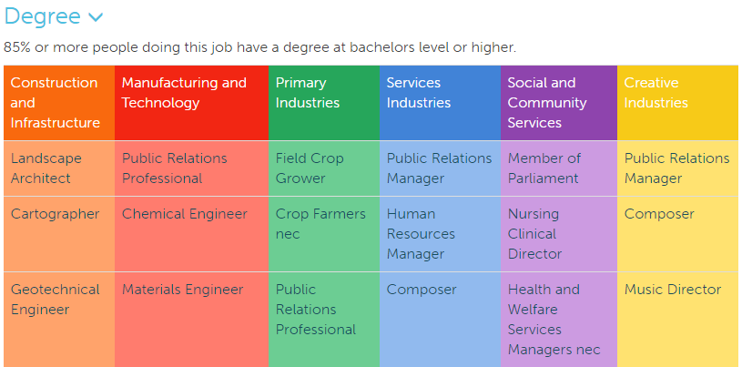
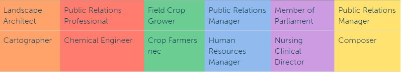

# Vocational Pathway page
The start of the page gives the description of what the page is about.

The rest of the page has five different levels of study:
* Degree
* Tertiary
* CertDipl
* Mixed
* School

Each of these are described on the page page below the headings.

Click on one of the headings to expand the section and see occupations which fall under that study level.

Once it has been expanded a table will be viewable.

The headings link to the vocational pathway pages on the vocational pathways website.

The body of the table has direct links to the occupation pages on the graduate outcomes site.

